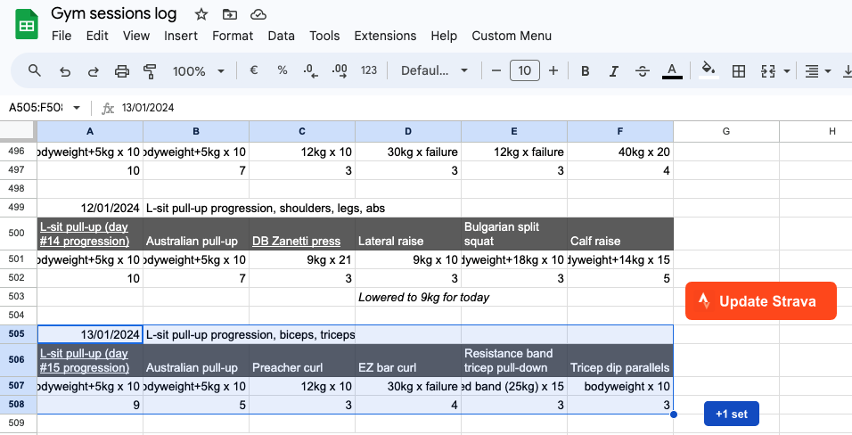
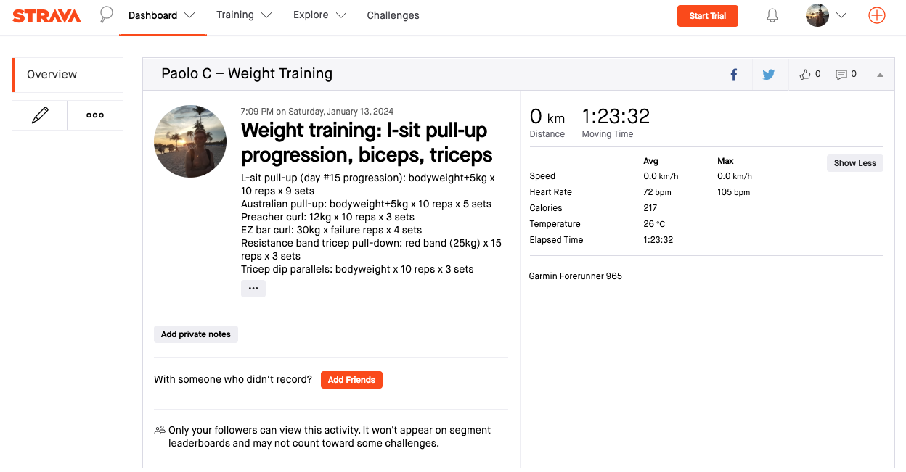
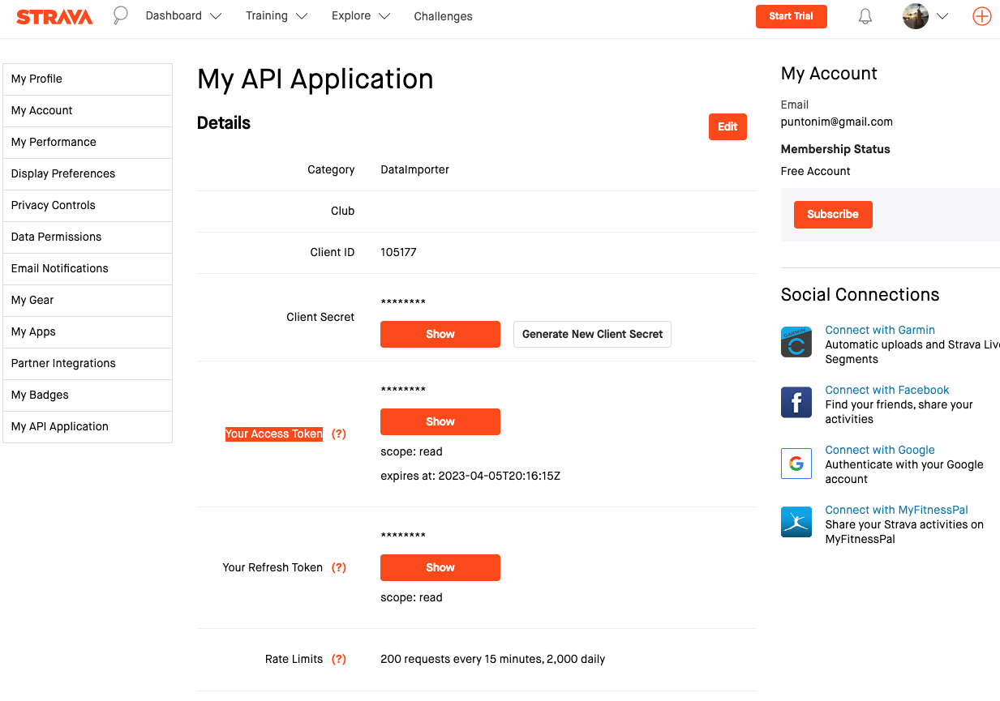

**Strava Facade API**
=======================

This API serves as a facade to simplify the interaction with Strava API.

So far there are 2 similar use cases.

Use case #1: update Strava activity description
-----------------------------------------------
- I keep a Google Sheet with the workout that I am doing;
- and I use my Garmin watch to monitor time and reps;
- at the end of the workout my Garmin watch creates the new Weight Training activity in Strava;
- and finally in Google Sheet I press a button and it updates the new Strava activity
   with all details (name of exercises with their # reps, # sets, weight, ...).

Use case #2: create new Strava activity
---------------------------------------
- When I attend a calisthenics class at YouReborn I add an entry to the Google Sheet;
- and then in Google Sheet I press a button and it creates a  new Strava activity
   with details (time of start, duration, note).

The Google Sheets uses Apps Script to read data from the sheet and to make an HTTP
 request to the AWS Lambda where this project is deployed.

The Google Sheet is named "Gym sessions log": https://docs.google.com/spreadsheets/d/14BLMOta2lPyXd0GeCgKQFDmc27u7WHo0XedzmL2-yks/edit?usp=sharing \
The source for the Apps Script is at [./scripts/apps-script.js](apps-script.js).

The Google Sheet looks like this:  \
And a Strava activity updated looks like this: 


Usage
=====
- Let the Garmin watch create the new Strava activity first;
- then use the "Update Strava" button in the Google Sheet to update the new Strava activity.

The Google Sheet makes an HTTP request similar to:
```sh
$ curl -X POST https://s8afs561v2.execute-api.eu-south-1.amazonaws.com/update-activity-description \
 -H 'Authorization: XXX' \
 -d '{"afterTs": 1707174000, "beforeTs": 1707260399, "description": "My new descr", "activityType": "WeightTraining", "name": "test1", "doStopIfDescriptionNotNull": "false"}'

{
  "resource_state": 3,
  "athlete": {
    "id": 115890775,
    "resource_state": 1
  },
  "name": "test1",
  "distance": 0.0,
  "moving_time": 7157,
  "elapsed_time": 7157,
  "total_elevation_gain": 0,
  "type": "WeightTraining",
  "sport_type": "WeightTraining",
  "id": 10709853894,
  "start_date": "2024-02-06T17:20:32Z",
  "start_date_local": "2024-02-06T18:20:32Z",
  "timezone": "(GMT+01:00) Africa/Algiers",
  "utc_offset": 3600.0,
  "location_city": null,
  "location_state": null,
  "location_country": "Italy",
  "achievement_count": 0,
  "kudos_count": 0,
  "comment_count": 0,
  "athlete_count": 1,
  "photo_count": 0,
  "map": {
    "id": "a10709853894",
    "polyline": "",
    "resource_state": 3,
    "summary_polyline": ""
  },
  "trainer": true,
  "commute": false,
  "manual": false,
  "private": false,
  "visibility": "followers_only",
  "flagged": false,
  "gear_id": null,
  "start_latlng": [],
  "end_latlng": [],
  "average_speed": 0.0,
  "max_speed": 0.0,
  "average_temp": 24,
  "has_heartrate": true,
  "average_heartrate": 77.0,
  "max_heartrate": 148.0,
  "heartrate_opt_out": false,
  "display_hide_heartrate_option": true,
  "elev_high": 0.0,
  "elev_low": 0.0,
  "upload_id": 11453524654,
  "upload_id_str": "11453524654",
  "external_id": "garmin_ping_319619866387",
  "from_accepted_tag": false,
  "pr_count": 0,
  "total_photo_count": 0,
  "has_kudoed": false,
  "description": "My new descr",
  "calories": 404.0,
  "perceived_exertion": null,
  "prefer_perceived_exertion": null,
  "segment_efforts": [],
  "laps": [
    {
      "id": 37068060147,
      "resource_state": 2,
      "name": "Lap 1",
      "activity": {
        "id": 10709853894,
        "visibility": "followers_only",
        "resource_state": 1
      },
      "athlete": {
        "id": 115890775,
        "resource_state": 1
      },
      "elapsed_time": 7157,
      "moving_time": 7157,
      "start_date": "2024-02-06T17:20:32Z",
      "start_date_local": "2024-02-06T18:20:32Z",
      "distance": 0.0,
      "average_speed": 0.0,
      "max_speed": 0.0,
      "lap_index": 1,
      "split": 1,
      "start_index": 0,
      "end_index": 4321,
      "total_elevation_gain": 0,
      "device_watts": false,
      "average_heartrate": 77.0,
      "max_heartrate": 148.0
    }
  ],
  "photos": {
    "primary": null,
    "count": 0
  },
  "stats_visibility": [
    {
      "type": "heart_rate",
      "visibility": "everyone"
    },
    {
      "type": "pace",
      "visibility": "everyone"
    },
    {
      "type": "power",
      "visibility": "everyone"
    },
    {
      "type": "speed",
      "visibility": "everyone"
    },
    {
      "type": "calories",
      "visibility": "everyone"
    }
  ],
  "hide_from_home": false,
  "device_name": "Garmin Forerunner 965",
  "embed_token": "33f24624d0d69cfd987523970ae102065eb6b101",
  "private_note": "",
  "available_zones": []
}
```


Development setup
=================

---

1 - System requirements
----------------------

**Python 3.12**\
The target Python 3.12 as it is the latest available environment at AWS Lambda.\
Install it with pyenv:
```sh
$ pyenv install -l  # List all available versions.
$ pyenv install 3.12.4
```

**Poetry**\
Pipenv is used to manage requirements (and virtual environments).\
Read more about Poetry [here](https://python-poetry.org/). \
Follow the [install instructions](https://python-poetry.org/docs/#osx--linux--bashonwindows-install-instructions).

**Pre-commit**\
Pre-commit is used to format the code with black before each git commit:
```sh
$ pip install --user pre-commit
# On macOS you can also:
$ brew install pre-commit
```

2 - Virtual environment and requirements
----------------------------------------

Create a virtual environment and install all deps with one Make command:
```sh
$ make poetry-create-env
# Or to recreate:
$ make poetry-destroy-and-recreate-env
# Then you can open a shell and/or install:
$ poetry shell
```

Without using Makefile the full process is:
```sh
# Activate the Python version for the current project:
$ pyenv local 3.12.4  # It creates `.python-version`, to be git-ignored.
$ pyenv which python
~/.pyenv/versions/3.12.4/bin/python

# Now create a venv with poetry:
$ poetry env use ~/.pyenv/versions/3.12.4/bin/python
# Now you can open a shell and/or install:
$ poetry shell
# And finally, install all requirements:
$ poetry install
```

To add a new requirement:
```sh
$ poetry add requests
$ poetry add pytest --dev  # Dev only.
$ poetry add requests[security,socks]  # With extras.


3 - Pre-commit
--------------

```sh
$ pre-commit install
```


Deployment
==========

---

### 0. Create API in Strava

To get API keys you need to create and API App in Strava.\
Note that you can create only 1 app.\
Go to: [https://www.strava.com/settings/api]()
and create a new API.\
Take note of the `client_id` and `client_secret`.\
The script `scripts/configure_parameter_store.py` that you will run in a later step
 will guide you to get a valid access token.\
Also note that the access token in that page ("Your Access Token") is NOT what you need
 here because it has a read-only scope.\
See screenshot:


### 1. Install deployment requirements

The deployment is managed by Serverless. Serverless requires NodeJS.\
Follow the [install instructions](https://github.com/nvm-sh/nvm#install--update-script) for NVM (Node Version Manager).\
Then:
```shell
$ nvm install --lts
$ node -v > .nvmrc
```
Follow the [install instructions](https://serverless.com/framework/docs/getting-started#install-as-a-standalone-binary)
for Serverless, something like `curl -o- -L https://slss.io/install | bash`.
We currently use version 3.12.0, if you have an older major version you can upgrade Serverless with: `sls upgrade --major`.

Then to install the Serverless plugins required:
```shell
#$ sls upgrade  # Only if you are sure it will not install a major version.
$ nvm install
$ nvm use
# You may need to restart your terminal before running the next command to avoid this warning:
#  WARN serverless-python-requirements@5.4.0 requires a peer of serverless@^2.32 || 3 but none is installed.
# The warning may eventually result in this error:
#  Error: Cannot find module '/hdmap-web/projects/job-scheduler/node_modules/es5-ext/-e'
$ sls plugin install -n serverless-python-requirements
# If it fails again try with:
$ npm install
```

### 2. Deployments steps

#### 2a. AWS Parameter Store
The first time even, you have to fill AWS Parameter Store with Strava API creds.\
In order to do so, run:
```sh
$ python scripts/configure_parameter_store.py
```

#### 2b. Version bump
Make sure you bumped the version in your last commit.\
If you haven't, then just run:
```shell
$ make version-bump/1.0.3
```
This will update the version in `pyproject.toml` and in `__version__.py`.
Note: do not edit the `version` in pyproject.toml directly or with `poetry version`.
Commit and push this change:
```shell
$ git add pyproject.toml
$ git commit -m "Slackbot: bump version to 1.0.3" -m "Bumping version from 1.0.2 to 1.0.3"
$ git push origin HEAD:master -o ci.skip
```

#### 2c. Actual deploy
Note: AWS CLI and credentials should be already installed and configured.\

Finally, deploy to **PRODUCTION** in AWS with:
```sh
$ sls deploy
# $ make deploy  # Alternative.
```

To deploy a single function (only if it was already deployed):
```sh
$ sls deploy function -f endpoint-health
```


Deploy to a DEV STAGE
---------------------

Pick a stage name: if your name is Jane then the best format is: `dev-jane`.  

To deploy your own **DEV STAGE** in AWS version:
```sh
# Deploy:
$ sls deploy --stage dev-jane
# Delete completely when you are done:
$ sls remove --stage dev-jane
```
